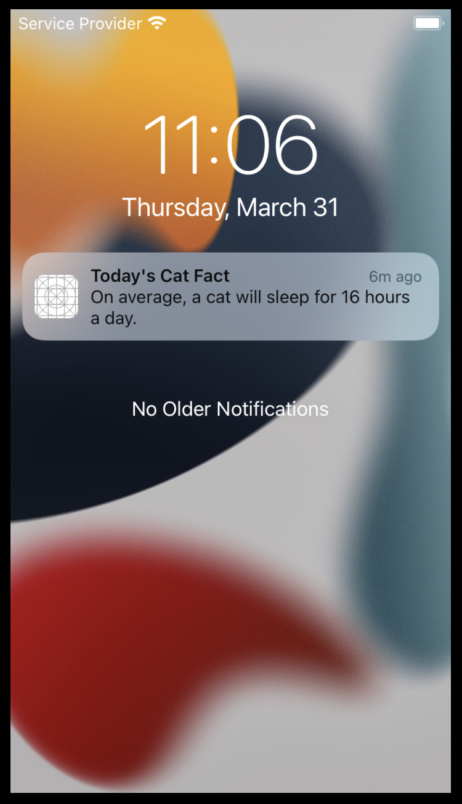

# CatFact
**CatFact** is a fun iOS app that tells you random facts about cats. 
The purpose of this app is to let users simply discover various cat facts provided by [Cat Facts API](https://catfact.ninja/) 
and entertain them with a user interface decorated with cute cat illustrations.

## Major Functions
1. View random cat facts provided by [Cat Facts API](https://catfact.ninja/) 
2. Add cat facts to your "Favourites"
3. View slide show of your favourite / random cat facts
4. Send a notification every day at 11AM

## How It Works

### 1. Discover cat facts
The app's home view has three options, ***Discover***, ***Favourites***, and ***Slide Show***. The ***Discover*** option directs you to the view that lets you know random cat facts supplied by the [Cat Facts API](https://catfact.ninja/). 

Ten cat facts are fetched at a time. You can scroll down the list and tap ***Load more*** at the bottom to fetch another ten cat facts.

### 2. Add facts to favourites
At the ***Discover*** view, you can add facts to your "favourites" by tapping the heart button at the right hand side of each fact. The added facts can be viewed at the ***favourites*** view. You can get to it by choosing ***Favourites*** option at the Home view.

The following demonstration firstly shows that the favourite collection is empty. If that's the case the ***Slide Show*** view also shows the same contents. It then shows adding some cat facts and checking they are available on the ***Favourites*** view.

### 3. View Slide Show
Once cat facts are added to your "favourites", you can view them as a slide show. This is another way of viewing cat facts for some entertainment. You can also choose to view the slide show of random cat facts in the same manner on the ***Slide Show*** view.

### 4. Send Notification
The **CatFact** app tells you a random cat fact every day at 11AM by using the notification function. 

When you first launch the app, choose ***Allow*** to permit the app sends you notifications.

In the following demonstration you can see that a notification appears on the home screen at 11AM.

The image below is the notification kept in the device to provide users with another opportunity to visit the app.

## Installation
Clone this repository, simply open it on Xcode and run using iOS Simulator or your device.

## Technology
The user interface is built based on SwiftUI as it is a new platform designed to provide a better and easier development experience.
